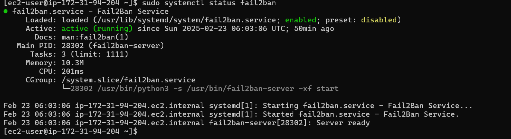

# Seting up SSH access on Linux servers

## 1. Server Provisioning
Create a server in any cloud provider and create a SSH key-pair initially to login to the server


## 2. Create SSH Keys locally
Before creating SSH keys locally check whether you have openssh installed by using openssh command if it returns the options then it is installed else make sure to install it 
you can use Putty if on windows 
After you are sure ssh is installed use command "ssh-keygen -t rsa -b 2048 -f file_path" to save file give a passphrase it is not mandatory but doing so is a good practice
This will create 2 files a private file and a file with extension .pub (this is the public file) 


## 3. Adding keys to the server
If you use linux locally you can use ssh-copy-id command to copy the pub file from local to server or you can use scp if you have windows and don't want to go through the hassle 
of doing this you can copy the contents of pub file present on your machine and add it to this folder (~/.ssh/authorized_keys) this will add those files on your server

Use the command
``` 
echo  "contents of pub file" >> ~/.ssh/authorized_keys
```
Also check the permissions of the ssh folder or the file it should be 700/600 if not you can use chmod command to do that

```
chmod 700 ~/.ssh
chmod 600 ~/.ssh/authorized_keys
```


## 4. Testing connectivity
Try connecting to the server using the ssh keys generated locally using this command "ssh -i user@server_ip" this will create a connection between local machine and server


## 5. Adding an alias
Now we have tested the ssh connection we can setup an alias so we need to add such a long command everytime to login
We can do so by creating a file named config in .ssh folder make sure to name the file as config with no extensions
In the config add this for each alias you want to create

```
Host aws-alt-server
HostName server-ip
User username
IdentityFile C:\Users\Pankaj\aws_main_2
```	
- Here myserver is the name of alias you will use to login 
- server-ip is the ip address of server
- username - the username of server
- IdentityFile - The location of private key file used to login

Now you can use this command to login to the server
``` bash
ssh aws-alt-server
```


## 6. Installing fail2ban (Optional)
I tried to install fail2ban on my server after connecting from my local machine
Fail2ban is a package that attempts to ban connection attempts from an ip address after it fails to connect to the server. This is helpful in stopping cyber attacks on a server
or if someone tries to launch a DoS/DDoS attack on our server
Since I have Amazon Linux Server which is based upon RedHat so we will use yum package manager to install those
``` bash
$ sudo yum update
$ sudo yum install fail2ban  
```
After installing fail2ban we need to start the service and enable it so that it starts on boot
``` bash
$ sudo systemctl start fail2ban
$ sudo systemctl enable fail2ban
```
Now fail2ban is installed and running on the server
Configure fail2ban by creating a configuration file present in /etc/fail2ban/jail.local
``` bash
$ sudo vi /etc/fail2ban/jail.local
```
Add the following content to the file
``` bash
[DEFAULT]
bantime = 10m           # How long an IP is blocked (10 minutes)
findtime = 10m          # Timeframe to check for failed attempts
maxretry = 5            # Max failed attempts before banning
logpath = /var/log/auth.log # Path where failed attempts are logged

[sshd]
enabled = true          # Activate Fail2ban for SSH
```
This will block an IP for 10 minutes if it fails to connect to the server 5 times in 10 minutes

After adding the content restart the fail2ban service
``` bash
$ sudo systemctl restart fail2ban
```
Check the status of fail2ban service
``` bash
$ sudo systemctl status fail2ban
```
